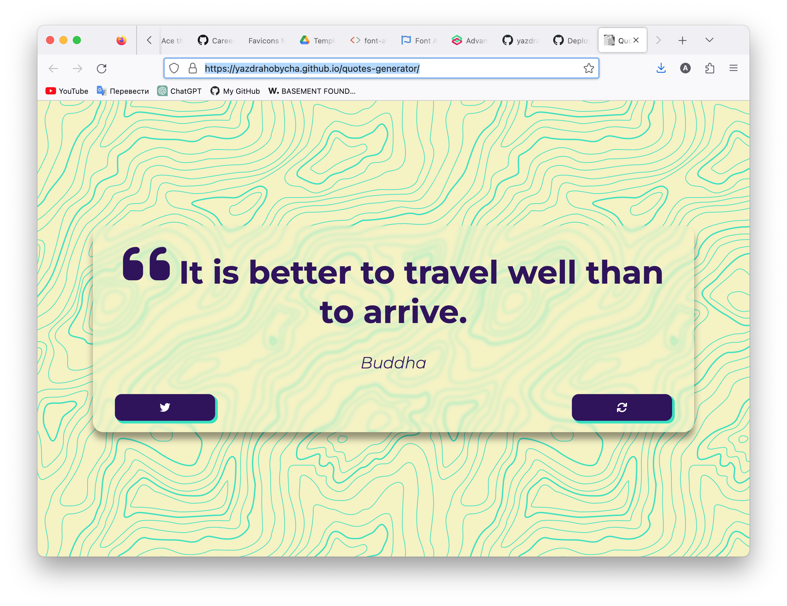

# Quote Generator

## Table of contents

- [Overview](#overview)
  - [The challenge](#the-challenge)
  - [Screenshot](#screenshot)
  - [Links](#links)
- [My process](#my-process)
  - [Built with](#built-with)
  - [What I learned](#what-i-learned)
  - [Continued development](#continued-development)
- [Author](#author)

## Overview

### The challenge

Users should be able to:

- See quote in the quote container
- Load new quote by clicking 'refresh' button
- Tweet quote by clicking 'twitter' button
- View the optimal layout depending on their device's screen size
- See hover and focus states for interactive elements

### Screenshot

  

### Links

- Solution URL: [https://yazdrahobycha.github.io/quotes-generator/](https://yazdrahobycha.github.io/quotes-generator/)

## My process

### Built with

- Semantic HTML5 markup
- Flexbox
- Async/Await
- [Type.fit API](https://type.fit/api/quotes)
- Font Awesome

### What I learned

The objective of this project is to acquaint oneself with asynchronous programming, to learn how to make requests using the "fetch()" method and process responses to these requests. Additionally, it was interesting to implement a Twitter share button, although it was quite straightforward.

### Continued development

1. Adding a button to change the theme of the page
2. Improve the UI of the page
3. Optimize the code for better performance and readability

## Author

- Instagram - [@yazdrahobycha](https://instagram.com/yazdrahobycha?igshid=YmMyMTA2M2Y=)
- Telegram - [Орсен](https://t.me/yazdrahobb)
